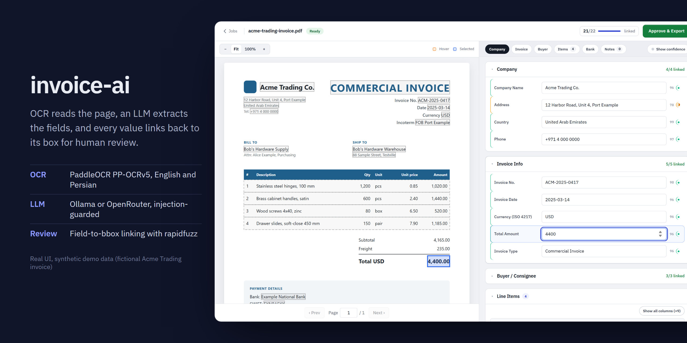
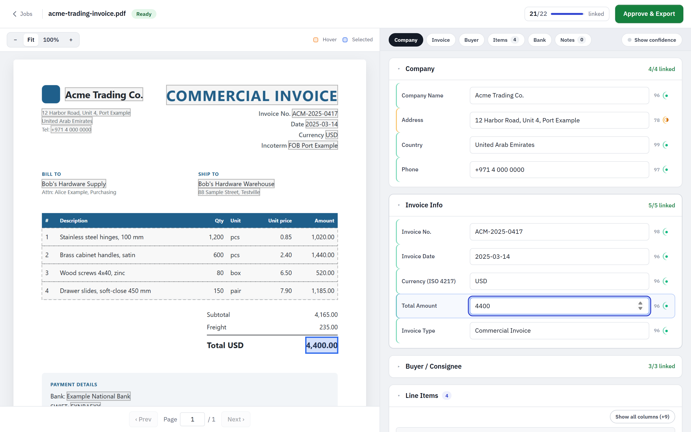
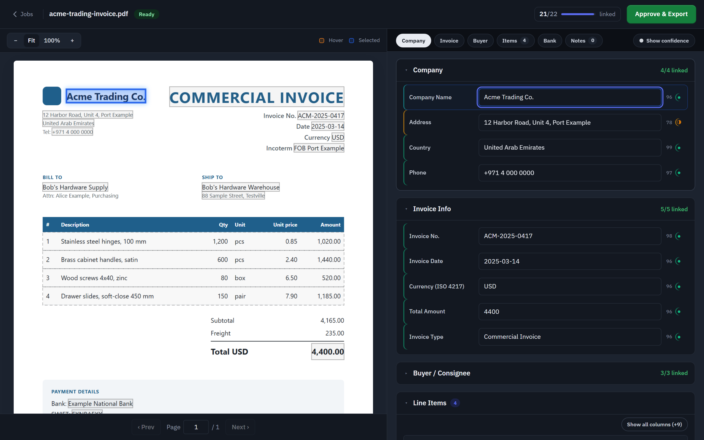
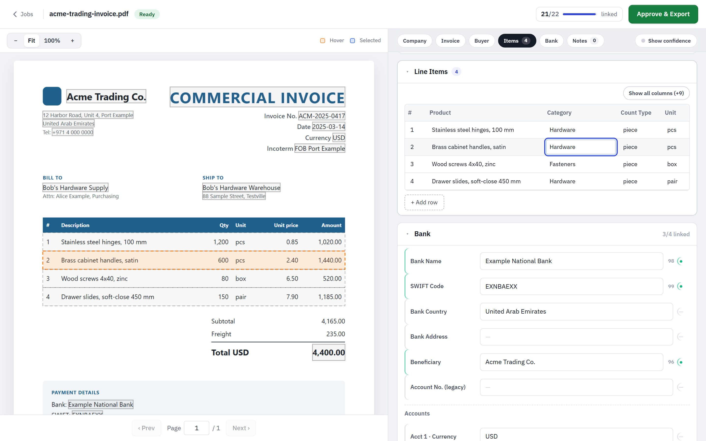
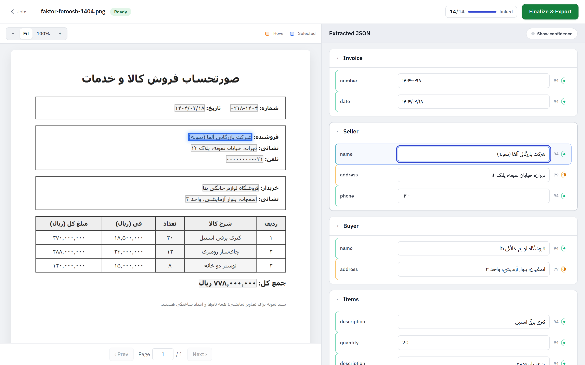
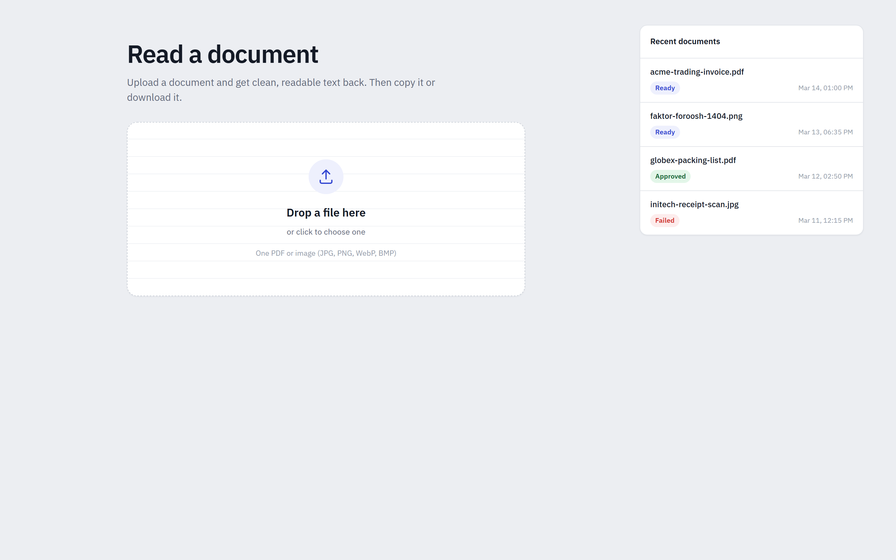
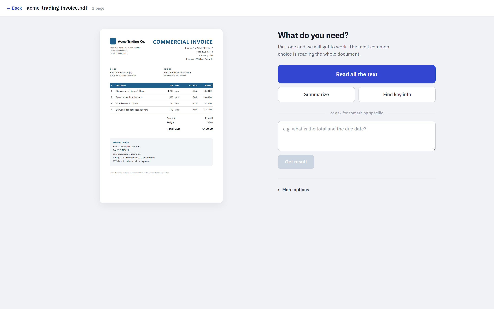
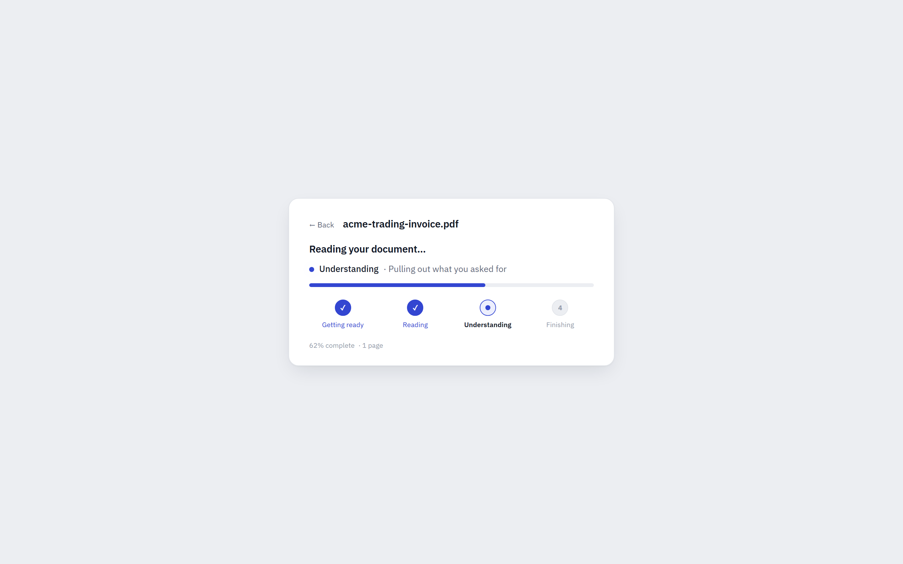
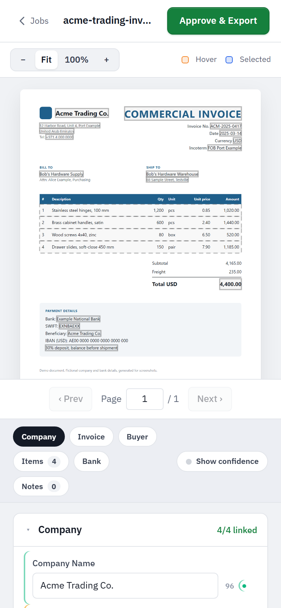
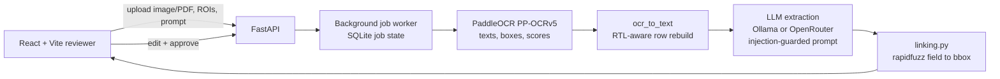

# invoice-ai



**Extract invoice fields with OCR + an LLM, then check every value against the exact box on the page it came from.**


Human-in-the-loop OCR and LLM extraction for invoices and scanned documents (English and Persian/Farsi): PaddleOCR reads the page, an LLM extracts structured fields, and a review UI links every field back to its box on the page so a person can verify and approve.

## Highlights

- **Click a field, see its source.** Every extracted value is fuzzy-linked to its OCR box; hover or select a field and the box lights up on the page.
- **Typed invoice schema or free-form prompt.** Pydantic `Invoice` model, or ask anything and get markdown or an editable JSON dict.
- **English and Persian.** RTL-aware row rebuild on the OCR side, `dir="auto"` inputs on the review side.
- **Injection-guarded extraction.** Document text goes to the LLM as untrusted data in a labeled envelope.
- **Runs fully local** with Ollama, or through OpenRouter.
- **Review UI** with confidence tiers, line-item row linking, inline edits, dark mode and a phone layout.

## Screenshots

All screenshots show the real UI with **demo data**: two fictional invoices (Acme Trading Co. and a Persian sample) rendered from HTML, with mocked API responses. No real documents.

| | |
|---|---|
|  |  |
| **Field review.** Selecting *Total Amount* highlights its box on the page; the left edge of each row shows the linking confidence tier. | **Dark mode** follows the OS setting. |
|  |  |
| **Line items.** Each extracted row links to its table row on the page and stays editable. | **Persian (RTL) document** with a free-form JSON prompt; values keep correct right-to-left order. |
|  |  |
| **Upload** a PDF or image; recent jobs on the right. | **Pick a task**: read all text, summarize, key info, or a custom question. |
|  |  |
| **Job progress**: Getting ready, Reading (OCR), Understanding (LLM extraction), Finishing (box linking). | **Phone layout** stacks the page above the fields. |

Regenerate them with `scripts/capture-screenshots.cjs` (Playwright; no backend, OCR or LLM needed). See the header of that file.

## Why it's interesting

- **Every extracted value points back to the page.** `app/linking.py` fuzzy-matches LLM output against OCR text with `rapidfuzz`, using a length-aware score and merging runs of adjacent tokens, so a value split over several OCR boxes (a company name across three boxes, say) becomes one merged polygon. The reviewer sees exactly where each field came from.
- **Prompt-injection guard on the extraction step.** OCR text is wrapped as untrusted data in a labeled envelope, and the system prompts tell the model never to follow instructions found in the document (`extract.py`, `_build_freeform_user_message`).
- **Two job modes.** A typed invoice schema (Pydantic `Invoice` / `LineItem` / `BankInfo`) or a free-form prompt that returns markdown text or an editable JSON dict.
- **Persian-aware OCR pipeline.** Per-job OCR language (PP-OCRv5), RTL-aware spatial row reconstruction (`ocr_to_text`), optional region-of-interest cropping, multi-page PDFs.
- **Provider switch.** Any OpenAI-compatible endpoint: local Ollama for fully on-box operation, or OpenRouter (`LLM_PROVIDER`, `extract.py: resolve_llm_config`).
- **Dormant sanctions-screening package** (`app/sanctions/`: OFAC, EU, UK and CSL loaders, fuzzy name matching, optional LLM judge). It is kept in the backend with tests but its UI is archived (`frontend/_archive/sanctions/`) and it is not part of the main flow.

## Architecture



The API enqueues a job; a single background worker runs OCR, builds text, calls the LLM, then links fields to bounding boxes. The UI polls job status and then shows the page with box overlays next to editable fields, line items and a confidence toggle. Job state lives in SQLite (`app/db.py`, `app/jobs.py`).

## Tech stack

Python 3.12, FastAPI, Pydantic v2, PaddleOCR 3.x, pypdfium2, rapidfuzz, OpenAI SDK (for Ollama/OpenRouter), SQLite, React + TypeScript + Vite, `uv`.

## Key techniques

- Structured output with tolerant JSON extraction and a typed schema: `extract.py`
- Prompt-injection envelope for untrusted document text: `extract.py`
- Fuzzy field-to-bbox linking, adjacent-token-run merging, line-item row linking: `app/linking.py`
- Job state machine with a background worker: `app/jobs.py`, `app/db.py`
- Configurable upload caps (size, PDF pages, megapixels): `.env.example`
- Sanctions matching and LLM judge (dormant): `app/sanctions/`

## Getting started

```bash
cp .env.example .env     # choose LLM_PROVIDER (ollama | openrouter) and fill that profile
uv sync
uv run uvicorn app.main:app --reload    # http://localhost:8000

cd frontend && npm install && npm run dev   # http://localhost:5173, proxies /api to :8000
```

CLI without the UI:

```bash
python process.py samples/invoice.pdf   # PDF -> OCR -> extracted.json under output/
```

`samples/` is empty on purpose: drop in your own invoices (see `samples/README.md`). On Windows, `run.bat` starts both servers. A local GPU deployment sketch (Ollama + systemd) is in `deploy/DEPLOY.md`.

## Tests

```bash
uv run --with pytest pytest app/tests
```

The existing tests cover only the dormant sanctions package. There are no automated tests for extraction or bbox linking yet.

## License

MIT, see [LICENSE](LICENSE).
